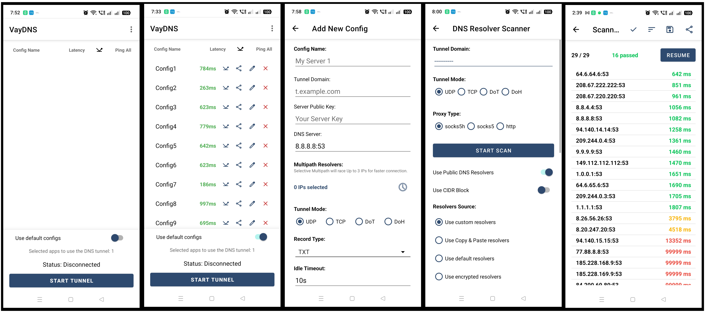

<div dir="rtl">

حق نشر © ۲۰۲۶ پروژه VayDNS VPN. منتشر شده تحت مجوز **VayDNS VPN Source-Available License**.

# نسخه اندروید کلاینت VayDNS VPN
وای دی ان اس VayDNS یک راهکار تونل‌زنی مبتنی بر DNS با کارایی بالا (High-performance) است. این پروژه که در ابتدا برای محیط‌های لینوکس جهت دور زدن محدودیت‌های اینترنتی طراحی شده بود، اکنون تکنولوژی هسته خود را برای دستگاه‌های اندرویدی بهینه‌سازی کرده است. این پیاده‌سازی با ترکیب سه تکنولوژی قدرتمند مبتنی بر زبان Go، یک تجربه VPN کامل برای کل دستگاه را در محدودترین شبکه‌ها فراهم می‌کند.

### اجزای اصلی:
<div dir="rtl">

* **vaydns**: 

لایه "تونل". داده‌ها را در قالب کوئری‌های DNS (از نوع DoH، DoT یا UDP) بسته‌بندی می‌کند تا از سد فایروال‌ها و بازرسی عمیق بسته‌ها (DPI) عبور کند.

</div>

<div dir="rtl">

- **Tun2Socks**:

 لایه "VPN". تمام ترافیک IP را از رابط مجازی TUN اندروید دریافت کرده و به صورت شفاف به تونل VayDNS هدایت می‌کند.
 
</div>

<div dir="rtl">

- **f35**:

 اسکنر E2E. برای تست و اندازه‌گیری سریع تاخیر (Latency) و پایداری ریزالورهای DNS در شبکه.
</div>

### شفافیت و هدف پروژه
پروژه VayDNS VPN یک پروژه شفاف و «کد-در دسترس» (Source-Available) است که با هدف ارتقای آزادی دیجیتال و فراهم کردن دسترسی امن به اینترنت برای کاربران در کشورهای دارای سانسور شدید اینترنتی فعالیت می‌کند. هدف اصلی این نرم‌افزار تسهیل ارتباطات آزاد و دسترسی به اطلاعات از طریق فناوری تونل‌سازی DNS است. این پروژه صرفاً جنبه آموزشی و بشردوستانه دارد؛ این نرم‌افزار هیچ سیستم، شبکه یا زیرساختی را مورد هدف، سوءاستفاده یا حمله قرار نمی‌دهد. کد منبع پروژه جهت بررسی عمومی (Audit) در دسترس قرار گرفته است تا شفافیت و اعتماد برای جامعه کاربرانی که برای ارتباطات آزاد به این ابزارها وابسته هستند، تضمین شود.

## قابلیت‌های کلیدی
- **کانفیگ‌های رمزنگاری شده:** پشتیبانی از «سرورهای پیش‌فرض» که توسط یک لایه امنیتی go محافظت می‌شوند تا از نشت اطلاعات زیرساخت صورت متن ساده جلوگیری شود.
- **آماده برای CI/CD:** خط لوله ساخت خودکار از طریق GitHub Actions که تنظیمات سرور را از طریق Secrets رمزنگاری شده تزریق می‌کند.
- **اسکن لحظه‌ای تاخیر:** اسکنر داخلی برای شناسایی سریع‌ترین ریزالورهای محلی جهت بهینه‌سازی عملکرد تونل.
- **پشتیبانی از چندین معماری:** باینری‌های نیتیو بهینه‌سازی شده برای معماری‌های arm64-v8a و armeabi-v7a.
- **پشتیبانی استاندارد از لینک‌های DNST:** سازگاری کامل با پروتکل DNST URL جهت اشتراک‌گذاری آسان تنظیمات بین اپلیکیشن‌های مختلف.
- **به‌روزرسانی از راه دور کانفیگ‌های پیش گزیده:**  کاربران می‌توانند هر زمان که سرورهای جدید یا بهینه‌سازی‌های تازه در دسترس قرار گرفت، کانفیگ‌های  پیش گزیده را بدون وقفه به‌روزرسانی کنند.

## 🔒 تأیید اصالت اپلیکیشن

نسخه‌های رسمی VayDNS را می‌توانید با استفاده از ابزار تأیید داخلی در منوی برنامه بررسی کنید.

کلید عمومی رسمی (Public Key): f7eb9ede225433ff8b9d22a61fe72b6b81b18ec9cb3bc70e7706b57f6e0fed7b


## تصاویر محیط برنامه VayDNS VPN
در اینجا تصاویر مربوط به پنجره اصلی، پنجره اصلی با کانفیگ‌های پیش‌فرض، مدیریت کانفیگ‌ها، اسکنر ریزالور و نتایج اسکنر ریزالور را مشاهده می‌کنید:
<p align="center">
  
</p>

**تصویری از ویژگی‌ها و قابلیت‌های VayDNS VPN**

## پیش‌نیازها

| ابزار | نسخه | هدف |
| :--- | :--- | :--- |
| Go | `1.25.8+` | منطق اصلی و کامپایل متقاطع |
| Android SDK | `API 24+` | یکپارچه‌سازی با سیستم‌عامل اندروید |
| Android NDK | `r27d` | کامپایل Go برای ARM64 |
| Java (JDK) | `17` | مورد نیاز برای Gradle و Android Studio |

## ۱. نصب Go (نسخه Linux/AMD64)
### گام اول: دانلود و نصب

```bash
# دانلود و نصب باینری رسمی:
wget [https://go.dev/dl/go1.25.8.linux-amd64.tar.gz](https://go.dev/dl/go1.25.8.linux-amd64.tar.gz) 
# حذف نسخه‌های قدیمی و استخراج (نیاز به sudo)
sudo rm -rf /usr/local/go
rm -rf ~/go
sudo tar -C /usr/local -xzf go1.25.8.linux-amd64.tar.gz
```

### گام دوم: تنظیم متغیرهای محیطی
این خطوط را به انتهای فایل ~/.bashrc اضافه کنید:
```bash
export PATH=$PATH:/usr/local/go/bin
export GOPATH=$HOME/go
export PATH=$PATH:$GOPATH/bin
```
اعمال تغییرات:  `source ~/.bashrc`

## ۲. تنظیمات محیط اندروید
* گام اول: نصب SDK و NDK
توصیه می‌شود از Android Studio استفاده کنید، اما برای سرورهای بدون گرافیک:

```bash
sdkmanager "platforms;android-24" "build-tools;34.0.0" "ndk;27.2.12479018"
```
### تنظیمات Android Studio
* در محیط Android Studio:
* به مسیر Settings > Languages & Frameworks > Android SDK بروید.
* زبانه (Tab) SDK Tools را انتخاب کنید.
* گزینه Show Package Details (در پایین سمت راست) را تیک بزنید.
* در بخش NDK (Side by side)، مطمئن شوید که یک نسخه نصب شده باشد (مثلاً نسخه 27.2.x برای پشتیبانی طولانی‌مدت یا آخرین نسخه موجود).
* در بخش SDK Platforms، مطمئن شوید که Android 7.0 (API 24) یا بالاتر نصب شده باشد.

### گام دوم: تنظیم متغیرهای محیطی
این خطوط را به انتهای فایل اضافه کنید: `~/.bashrc`
```bash
export ANDROID_HOME=$HOME/Android/Sdk
export ANDROID_NDK_HOME=$ANDROID_HOME/ndk/27.2.12479018
export JAVA_HOME=/usr/lib/jvm/java-17-openjdk
export PATH=$PATH:$ANDROID_HOME/cmdline-tools/latest/bin:$ANDROID_HOME/platform-tools:$JAVA_HOME/bin:$PATH
```

## ۳. آماده‌سازی وابستگی‌ها
برای جلوگیری از خطاهای "package not found" در هنگام بیلد (Build)، ما نسخه‌ی ابزارهای موبایل را با استفاده از فایل `tools.go` اصطلاحاً "پین" می‌کنیم.

### گام اول: ایجاد فایل `tools.go`
وارد پوشه‌ی `mobile` شوید و از ثابت بودن نسخه‌ی ابزارها (toolchain) مطمئن شوید.
فایلی با نام `mobile/tools.go` بسازید تا مطمئن شوید کامپایلر Go ابزارهای اتصال (binding) موبایل را کش می‌کند:

```
// +build tools 
package mobile

import (
        _ "golang.org/x/mobile/bind"
        _ "golang.org/x/mobile/cmd/gobind"
        _ "golang.org/x/mobile/cmd/gomobile"
)
```
سپس دستورات زیر را اجرا کنید:
```bash
cd vaydns-vpn/mobile
go mod tidy
go install golang.org/x/mobile/cmd/gomobile@latest
go install golang.org/x/mobile/cmd/gobind@latest
gomobile init
```

## ۴. ساخت پروژه (Build)
### تولید کتابخانه اندروید (.aar)
```
# Build for ARM64
cd mobile
gomobile bind -v \
    -target=android/arm64 \
    -androidapi 24 \
    -ldflags="-s -w" \
    -trimpath \
    -o ../vaydns-arm64.aar \
    .

# Move the library to the Android project libs folder
cp vaydns-arm64.aar android/app/libs/
```
### ساخت فایل نهایی APK
می‌توانید از Android Studio یا دستور gradlew استفاده کنید.
```bash
cd android
./gradlew assembleRelease
```
## عیب‌یابی
* خطای پکیج Bind: اگر با خطایی مبنی بر پیدا نشدن golang.org/x/mobile/bind مواجه شدید، مطمئن شوید که پس از ایجاد فایل tools.go در پوشه mobile/ دستور go mod tidy را اجرا کرده‌اید.

* پیدا نشدن NDK: اطمینان حاصل کنید که متغیر ANDROID_NDK_HOME دقیقاً به پوشه نسخه مربوطه (مثلاً ndk/27.2.12479018) اشاره می‌کند، نه فقط به پوشه ریشه ndk.

## راهنمای استفاده از VayDNS

برای راه‌اندازی و شروع کار با تونل امن، مراحل زیر را دنبال کنید:

۱. **انتخاب برنامه‌ها برای تونل (Split Tunneling)**: روی گزینه **SELECT APPS TO TUNNEL** ضربه بزنید و چند برنامه خاص (پیشنهاد می‌شود ۳ تا ۴ برنامه) را برای عبور از تونل انتخاب کنید. فقط ترافیک برنامه‌های انتخاب شده از تونل عبور می‌کند و بقیه برنامه‌ها از اینترنت عادی شما استفاده خواهند کرد.

۲. **افزودن پیکربندی (Configuration)**:
    
- برای استفاده از سرور شخصی خود: منو (سه نقطه) را باز کرده و **Add Config** را انتخاب کنید.
    
- برای استفاده از سرورهای پیش‌فرض: گزینه **Use default configs** را فعال کرده و یکی از سرورهای لیست را انتخاب کنید.

۳. **یافتن یک DNS (Resolver) مناسب**: برای برقراری اتصال، باید یک Resolver فعال که با شبکه شما سازگار باشد پیدا کنید.

- از منو گزینه **DNS Scanner** را انتخاب کنید.
    
- از پارامترهای پیش‌فرض استفاده کنید و روی **START SCAN** ضربه بزنید.
    
- پس از اتمام اسکن، به دنبال موردی بگردید که تاخیر (Latency) آن کمتر از **6000 میلی‌ثانیه** باشد.
    
- روی آیکون **تأیید (Checkmark)** ضربه بزنید تا سریع‌ترین Resolver مستقیماً روی تنظیمات شما اعمال شود، یا از آیکون **ذخیره (Save)** برای نگهداری لیست Resolverهای سریع استفاده کنید.
    
- نکته: اگر هیچ Resolver مناسبی پیدا نشد، به عقب برگردید و اسکن جدیدی شروع کنید تا لیست تصادفی جدیدی دریافت کنید.


۴. **شروع اتصال (Start Tunnel)**: به منوی اصلی برگردید و روی **START TUNNEL** ضربه بزنید. برقراری اتصال پایدار ممکن است تا **۲۰ ثانیه** زمان ببرد.

۵. **عیب‌یابی**: پیکربندی‌های مختلف از انواع رکوردهای DNS (مانند TXT یا NULL) استفاده می‌کنند. ممکن است یک Resolver که برای یک سرور کار می‌کند، برای سرور دیگر مناسب نباشد. در صورت عدم اتصال، سرور یا نوع رکورد را تغییر دهید.

۶. **انتظارات از عملکرد**: لطفاً توجه داشته باشید که تونل‌سازی DNS به دلیل ماهیت پروتکل و سربار داده‌ها، ذاتا کندتر از VPNهای معمولی است. بسته به شرایط شبکه، انتظار سرعتی بین **۱۰ تا ۲۰۰ کیلوبایت بر ثانیه** را داشته باشید.

## قدردانی
این پروژه بدون تلاش‌ها و کارهای ارزشمند مخازن متن‌باز (Open-source) زیر امکان‌پذیر نبود:
<div dir="rtl">

-   **[vaydns](https://github.com/net2share/vaydns)**:

برای موتور اصلی تونل‌زنی DNS و لایه‌های انتقال پیشرفته.
</div>

<div dir="rtl">

-   **[tun2socks](https://github.com/xjasonlyu/tun2socks)**:

برای پیاده‌سازی با کارایی بالای تبدیل TUN به SOCKS که امکان استفاده از VPN برای کل سیستم را فراهم می‌کند.
</div>

<div dir="rtl">

-   **[f35](https://github.com/nxdp/f35)**:

برای اسکنر سرتاسری (End-to-End) ریزالورهای DNS.

</div>

<div dir="rtl">

-   **[dnst-url-spec](https://github.com/net2share/dnst-url-spec)**:

فرمت استاندارد URL جهت اشتراک‌گذاری تنظیمات پروکسیِ تونل DNS در میان تمامی برنامه‌ها و کلاینت‌های سازگار.

</div>

## مجوز و سلب مسئولیت (License & Disclaimer)

### مجوز (License)
این پروژه تحت مجوز **VayDNS VPN Source-Available License** ارائه شده است.

لطفاً برای مشاهده متن کامل حقوقی به فایل [LICENSE](LICENSE) مراجعه کنید. همچنین برای اطلاع از قطعات نرم‌افزاری شخص ثالث و مجوزهای مربوط به آن‌ها، فایل [THIRD-PARTY-NOTICES.txt](THIRD-PARTY-NOTICES.txt) را مطالعه نمایید.

### سلب مسئولیت (Disclaimer)
این نرم‌افزار «به همان شکلی که هست» (AS IS) و بدون هیچ‌گونه ضمانتی از هر نوع ارائه می‌شود. استفاده از VayDNS VPN با مسئولیت شخص شما انجام می‌گیرد. توسعه‌دهندگان هیچ‌گونه مسئولیتی در قبال سوءاستفاده، از دست رفتن داده‌ها یا عواقب قانونی ناشی از استفاده از این نرم‌افزار ندارند. کاربران به تنهایی مسئول رعایت قوانین و مقررات محلی خود در رابطه با استفاده از فناوری‌های VPN و تونل‌سازی هستند.
